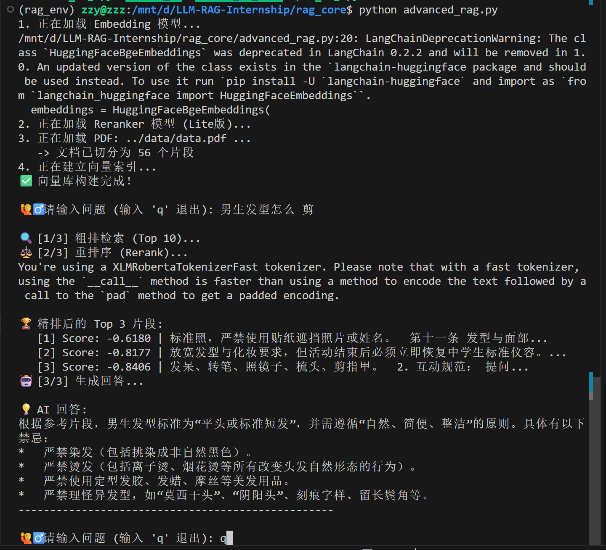
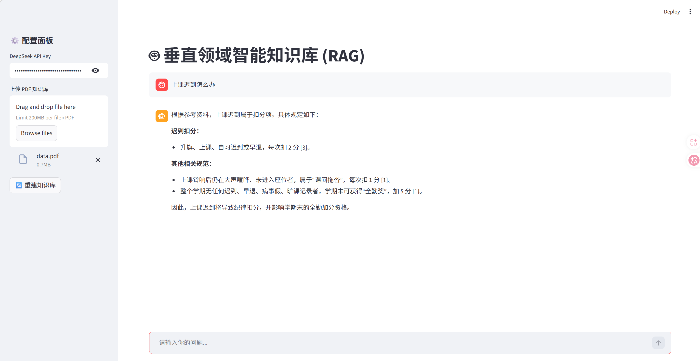

# 🤖 垂直领域智能知识库助手 (Vertical Domain RAG Assistant)

> 基于 LangChain + RAG + Rerank 技术的智能问答系统，解决通用大模型在特定领域（如企业文档、校园教务）存在的幻觉与时效性问题。

## 📸 功能展示 (Screenshots)

|主界面概览|聊天演示|
|:---:|:---:|
|||

## ✨ 项目亮点 (Key Features)

*   **⚡️ 端到端 RAG 架构**: 实现了从 PDF 文档解析、分块 (Chunking)、向量化 (Embedding) 到检索 (Retrieval) 的完整链路。
*   **🎯 双阶段检索优化**: 引入 **BGE-Reranker** 模型，采用“Recall (粗排) + Rerank (精排)”策略，显著解决了向量检索语义匹配不准的问题。
*   **🚀 极速响应体验**: 全面支持流式输出 (Streaming)，让 AI 回复像打字机一样流畅。
*   **🛡️ 数据隐私安全**: API Key 通过环境变量管理，杜绝硬编码泄露风险；支持本地私有化部署。
*   **🖥 可视化交互**: 使用 **Streamlit** 搭建了友好的 Web 聊天界面，支持 PDF 实时上传与知识库热更新。

## 🛠️ 技术栈 (Tech Stack)

*   **大语言模型 (LLM)**: DeepSeek V3 (API)
*   **开发框架**: LangChain, PyTorch
*   **向量数据库**: ChromaDB
*   **检索与重排**: BAAI/bge-small-zh-v1.5, BAAI/bge-reranker-base
*   **前端界面**: Streamlit

## 📂 目录结构 (Directory Structure)

```text
LLM-RAG-Internship/
├── .env.example            # 环境变量配置模板 (使用前复制为 .env)
├── app.py                  # Streamlit Web 应用入口 (主程序)
├── rag_core/               # RAG 核心算法模块
│   ├── pdf_rag.py          # 基础 RAG 实现
│   └── advanced_rag.py     # 进阶 RAG 实现 (加入 Rerank)
├── basic_demos/            # 基础原理验证代码 (API调用, 余弦相似度手写实现)
│   ├── embedding_test.py   # Embedding 原理演示
│   ├── llm_api.py          # LLM API 调用演示
│   └── simple_rag.py       #不仅是最简单的RAG，更是 RAG 的本质
├── data/                   # 测试用 PDF 数据
├── figure/                 # 项目截图资源
├── requirements.txt        # 项目依赖库
└── README.md               # 项目说明文档
```

## 🚀 快速开始 (Quick Start)

### 1. 环境准备
建议使用 Conda 创建独立的虚拟环境，避免依赖冲突：
```bash
# 创建环境
conda create -n rag_env python=3.10
conda activate rag_env

# 安装依赖
pip install -r requirements.txt
```

### 2. 配置 API Key
本项目使用环境变量管理敏感信息。
1. 复制配置模板：
   ```bash
   cp .env.example .env
   ```
2. 编辑 `.env` 文件，填入你的 DeepSeek API Key：
   ```ini
   DEEPSEEK_API_KEY=sk-xxxxxxxxxxxxxxxxxxxxxxxxxxxxxxxx
   ```

### 3. 启动应用
在终端运行以下命令启动 Web 服务：
```bash
streamlit run app.py
```
启动成功后，浏览器会自动打开 `http://localhost:8501`。

## 📝 核心原理解析

### 1. 为什么需要 RAG？
通用大模型虽然知识渊博，但无法获知“私有数据”（如个人文档、公司财报）。通过 RAG 技术，我们将私有数据转化为向量存储，当用户提问时，系统先检索相关片段，再将其作为“参考资料”喂给大模型，从而实现精准问答。

### 2. Rerank 重排序的意义
传统的向量检索（Bi-Encoder）基于语义相似度，虽然速度快，但容易检索到“似是而非”的内容。本项目引入了 **Cross-Encoder (Reranker)** 进行二次精排，通过对【问题-文档】对进行深度交互计算，大幅提升了 Top-3 的准确率。

---

**Author**: 查志渊
